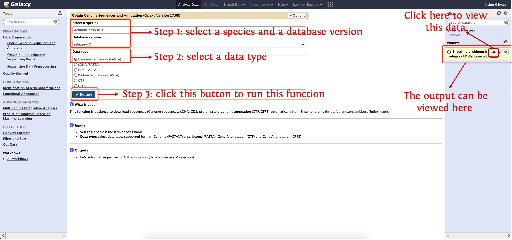
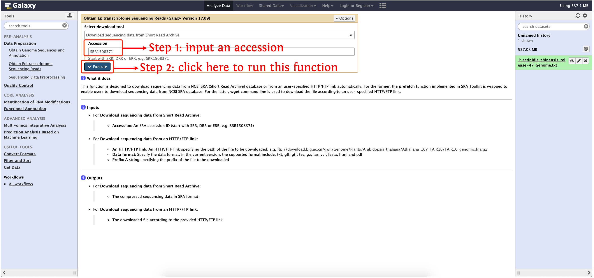
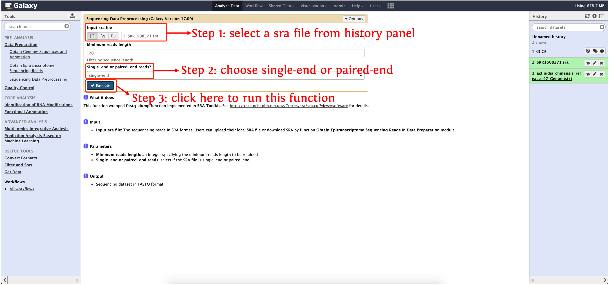

<strong>deepEA User Manual</strong>

(version 1.0)

- deepEA is a convenient, freely available, web-based platform that is capable to support deep analysis of epitranscriptome sequencing data with several general and specific functionalities. deepEA consists of six modules: **Data Preparation, Quality Control, Identification of RNA Modifications, Functional Annotation, Multi-omics Integrative Analysis and Prediction Analysis Based on Machine Learning**. 
- deepEA project is hosted on https://cma2015.github.io/deepEA. 
- deepEA docker image is available in https://hub.docker.com/r/malab/deepea.
- The deepEA demo server can be accessed via http://deepea.omicstudio.cloud.
- The following part shows installation of deepEA docker image and detailed documentation for each function in deepEA.

## Data Preparation

This module provides three funcitons (see following table for details) to prepare epitranscriptome data.

| **Tools**                                    | **Description**                                              | **Input**                                             | **Output**                                                   | **Time (test data)**         | **Reference**                                                |
| -------------------------------------------- | ------------------------------------------------------------ | ----------------------------------------------------- | ------------------------------------------------------------ | ---------------------------- | ------------------------------------------------------------ |
| **Obtain Genome Sequences and Annotation**   | Directly fetch genome, cDNA, CDS sequences and annotation from Ensembl plants database (https://plants.ensembl.org/index.html) | Select a species, a database version, and a data type | Sequences in FASTA format or GTF annotation (depends on user's selection) | Depends on the network speed | In-house scripts                                             |
| **Obtain Epitranscriptome Sequencing Reads** | Directly fetch epitranscriptome sequencing reads from NCBI's SRA database | SRR accession or HTTP/FTP link                        | Sequencing reads in SRA format                               | Depends on the network speed | <a href="https://github.com/ncbi/sra-tools" target="_blank">SRA Toolkit</a> |
| **Sequence Data Preprocessing**              | Convert epitranscriptome sequencing reads from SRA to FASTQ format | Epitranscriptome sequencing reads in SRA format       | Epitranscriptome sequencing reads in FASTQ format            | ~2 mins                      | <a href="https://github.com/ncbi/sra-tools" target="_blank">SRA Toolkit</a> |

## Obtain Genome Sequences and Annotation

This function is designed to download sequences (Genome sequences, cDNA, CDS, proteins) and genome annotation (GTF/GFF3) automatically from Ensembl plants (https://plants.ensembl.org/index.html).

#### Input
- **Select a species**: the latin name of 61 species are listed
- **Select database version**: Ensembl releases from 25 to 47 are listed
- **Select data type**: Genome sequences, cDNA, CDS, Protein Sequences, GTF and GFF3

#### Output
- Sequences in FASTA format or annotation in GTF/GFF3 format (depends on users' selection)

#### How to use this function
- The following screenshot shows us how to download genome sequences using deepEA

	

## Obtain Epitranscriptome Sequencing Reads

This function is designed to download epitranscriptome sequencing reads from NCBI SRA (Short Read Archive) database or from an user-specified HTTP/FTP link automatically. For the former, the **prefetch** function implemented in <a href="https://github.com/ncbi/sra-tools" target="_blank">SRA Toolkit</a> is wrapped to enable users to download sequencing data from NCBI SRA database; For the latter, **wget** command line is used to download the file according to an user-specified HTTP/FTP link.

#### Input

- For **Download sequencing data from Short Read Archive**:

	- **Accession:** An SRA accession ID (start with SRR, DRR or ERR, e.g. SRR1508371)

- For **Download sequencing data from an HTTP/FTP link**:
	- **An HTTP/FTP link**: An HTTP/FTP link specifying the path of the file to be downloaded, e.g. ftp://download.big.ac.cn/gwh/Genome/Plants/Arabidopsis_thaliana/Athaliana_167_TAIR10/TAIR10_genomic.fna.gz
  - **Data format**: Specify the data format, in the current version, the supported format include: txt, gff, gtf, tsv, gz, tar, vcf, fasta, html and pdf
  - **Prefix**: A string specifying the prefix of the file to be downloaded
  

#### Output
- For **Download sequencing data from Short Read Archive**:
	- The compressed sequencing data in SRA format
- For **Download sequencing data from an HTTP/FTP link**:
	- The downloaded file according to the provided HTTP/FTP link

#### How to use this function

- The following screenshot shows us how to download sequencing reads in SRA format

  

## Sequence Data Preprocessing
This function wrapped **fastq-dump** function implemented in SRA Toolkit. See http://trace.ncbi.nlm.nih.gov/Traces/sra/sra.cgi?view=software for details.

#### Input
- **Input sra file:** The sequenceing reads in SRA format. Users can upload their local SRA file or download SRA by function **Obtain Epitranscriptome Sequencing Reads** in **Data Preparation** module
#### Output
- Sequencing dataset in FASTQ format
#### How to use this function
- The following screenshot shows us how to use this function to convert sequencing reads in SRA format to FASTQ format
  

