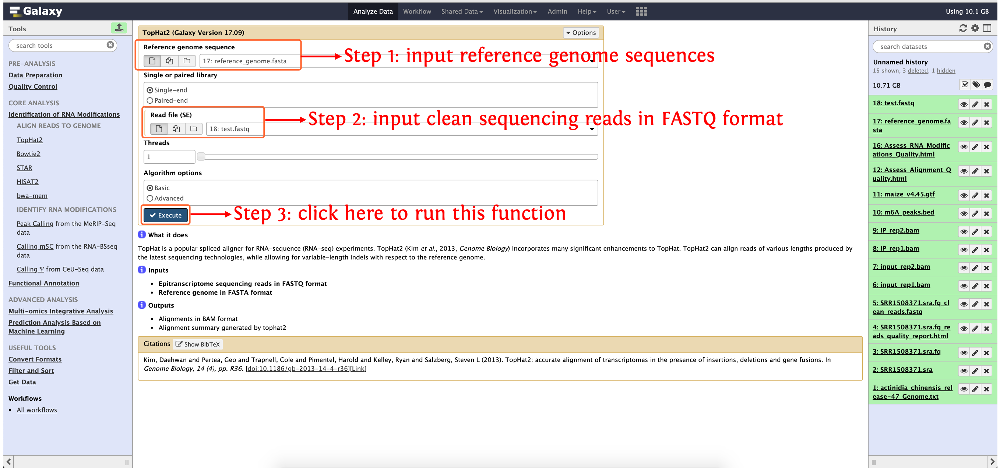
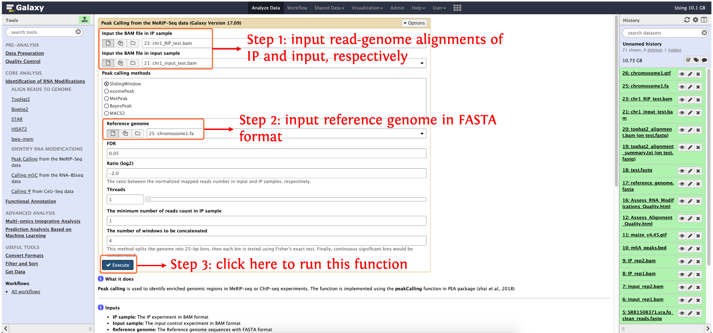
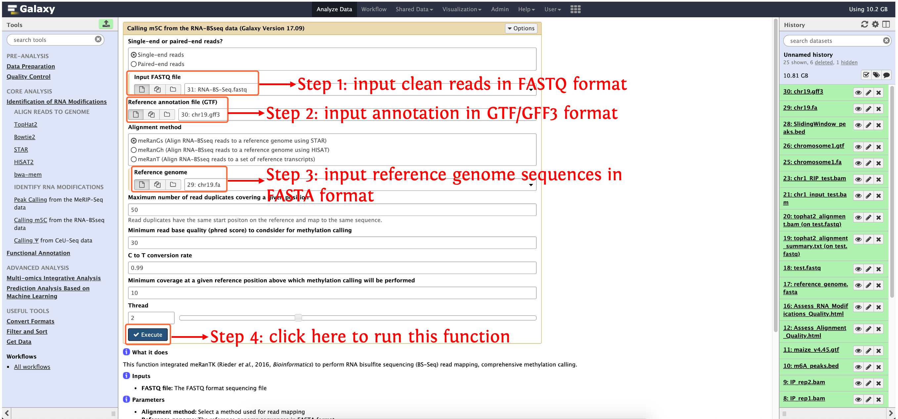
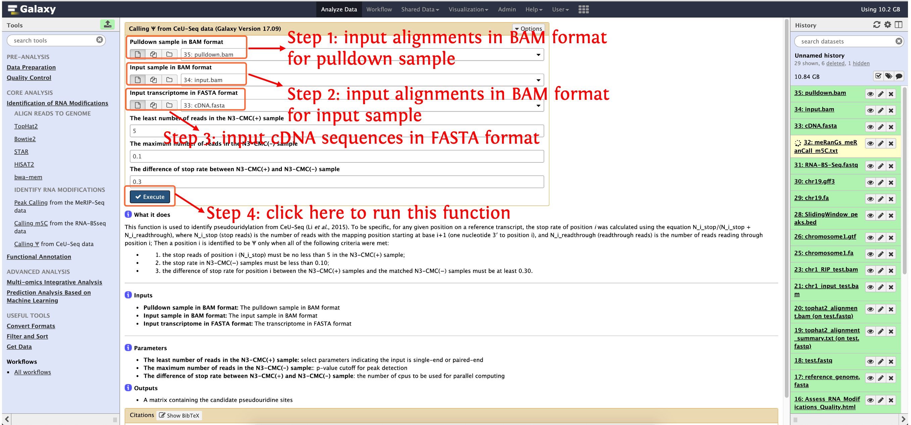

<strong>deepEA User Manual</strong>

(version 1.0)

deepEA is a convenient, freely available, web-based platform that is capable to support deep analysis of epitranscriptome sequencing data with several general and specific functionalities. Currently, deepEA consists of six modules: **Data Preparation, Quality Control, Identification of RNA Modifications, Functional Annotation, Multi-omics Integrative Analysis and Prediction Analysis Based on Machine Learning**. deepEA project is hosted on https://github.com/cma2015/deepEA. The deepEA demo server can be accessed via https://deepea.nwafu.edu.cn or http://39.101.176.205:4006. The following part shows installation of deepEA docker image and detailed documentation for each function in deepEA.

## Identification of RNA Modifications

This module provides step-by-step functions required for epitranscriptome reads mapping and identification of RNA modifications.

#### Align Reads to Genome

Several commonly used aligners are wrapped to align epitranscriptome reads to genome. Currently, <a href="https://ccb.jhu.edu/software/tophat/index.shtml" target="_blank">Tophat2</a>, <a href="http://bowtie-bio.sourceforge.net/bowtie2/index.shtml" target="_blank">Bowtie2</a>, <a href="https://github.com/alexdobin/STAR" target="_blank">STAR</a>, <a href="https://www.ccb.jhu.edu/software/hisat/index.shtml" target="_blank">HISAT2</a>, <a href="https://bio-bwa.sourceforge.net/bwa.shtml" target="_blank">bwa-mem</a>.

<table border="2" align="center" cellspacing="0" cellpadding="" id="grid4">
					<tr>
						<td><b>Tools</b></td>
						<td><b>Description</b></td>
						<td><b>Input</b></td>
						<td><b>Output</b></td>
						<td><b>Time (test data)</b></td>
						<td><b>Reference</b></td>
					</tr>
					<tr>
						<td><strong>Tophat2</strong></td>
						<td>Tophat2 is a spliced aligner, which aligns short reads by calling Bowtie2 but alows for variable-length indels with respect to the reference genome.</td>
						<td rowspan="5">Epitranscriptome sequencing reads in FASTQ format and reference genome sequences in FASTA format</td>
						<td rowspan="5">Read alignments in SAM/BAM format</td>
						<td>~50s</td>
						<td><a href="https://genomebiology.biomedcentral.com/articles/10.1186/gb-2013-14-4-r36" target="_blank">Kim <em>et al</em>., 2013, Genome Biology</a></td>
					</tr>
					<tr>
						<td><strong>Bowtie2</strong></td>
						<td>Bowtie2 is a short read aligner which achieves a combination of high speed, sensitivity and accuracy by combining the strengths of the full-text minute index with the flexibility and speed of hardware-accelerated dynamic programming algorithms, therefore bowtie2 is suitable for large genomes</td>
						<td>~10 s</td>
						<td><a href="https://www.nature.com/articles/nmeth.1923" target="_blank">Langmead <em>et al</em>., 2012, Nature Methods</a></td>
					</tr>
					<tr>
						<td><strong>STAR</strong></td>
						<td>STAR is an ultrafast universal RNA-Seq aligner and can discover non-canonical splices and chimeric (fusion) transcripts</td>
						<td>~16s</td>
						<td><a href="https://academic.oup.com/bioinformatics/article/29/1/15/272537" target="_blank">Dobin <em>et al</em>., 2013, Bioinformatics</a></td>
				   </tr>
				   <tr>
						<td><strong>HISAT2</strong></td>
						<td>HISAT2 is an ultrafast spliced aligner with low memory requirements. It supports genomes of any size, including those larger than 4 billion bases</td>
						<td>~8s</td>
						<td><a href="https://www.nature.com/articles/nmeth.3317" target="_blank">Kim <em>et al</em>., 2015, Nature Methods</a></td>
				   </tr>
				   <tr>
						<td><strong>bwa-mem</strong></td>
						<td>bwa-mem is a relatively early aligner based on backward search with Burrows–Wheeler Transform</td>
						<td>~10s</td>
						<td><a href="https://academic.oup.com/bioinformatics/article/25/14/1754/225615" target="_blank">Li <em>et al</em>., 2009, Bioinformatics</a></td>
				   </tr>
</table>

#### Identify RNA Modifications

**Identify RNA Modifications** implements three pipelines for MeRIP-Seq, CeU-Seq and RNA-BSSeq, respectively.

| **Tools**                                          | **Description**                                              | **Input**                                                    | **Output**                           | **Time (test data)**     | **Reference**                                                |
| -------------------------------------------------- | ------------------------------------------------------------ | ------------------------------------------------------------ | ------------------------------------ | ------------------------ | ------------------------------------------------------------ |
| **Peak Calling from the MeRIP-Seq data**           | Identify enriched genomic regions from MeRIP-Seq experiment  | Read alignments of IP and input in SAM/BAM format and reference genome sequences in FASTA format | RNA modifications in BED format      | ~36s                     | <a href="https://academic.oup.com/bioinformatics/article/34/21/3747/5021690" target="_blank">Zhai <I>et al</I>., 2018, Bioinformatics</a> |
| **Calling m5C from the RNA-BSseq data** | Perform bisulfite sequencing (BS-Seq) read mapping, comprehensive methylation calling using meRanTK | Sequencing reads in FASTQ format and reference genome sequences in FASTA format | m5C sites in BED format   | ~10 mins using 2 threads | <a href="https://academic.oup.com/bioinformatics/article/32/5/782/1744216" target="_blank">Rieder <I>et al</I>., 2016, Bioinformatics</a> |
| **Calling Ψ from CeU-Seq data**                    | Identify pseudouridylation from CeU-Seq                      | Read alignments in SAM/BAM format and cDNA sequences in FASTA format | Pseudoridylation sites in BED format | ~1 mins                  | <a href="https://www.nature.com/articles/nchembio.1836" target="_blank">Li <I>et al</I>., 2015, Nature Chemical Biology</a> |

## Align reads to genome

Currently, deepEA wrapped five aligners to map epitranscriptome reads to genome, here, we take <a href="https://ccb.jhu.edu/software/tophat/index.shtml" target="_blank">Tophat2</a> as an example to show how to use deepEA to run reads mapping, the other four aligners are similar.

#### Input

- **Epitranscriptome sequencing reads in FASTQ format** 
- **Reference genome in FASTA format** 

#### Output

- Alignments in BAM format
- Alignment summary generated by tophat2

#### How to use this function

- **Step 1**: upload the data in directory `test_data/Identification_of_RNA_Modifications/Align_Reads_to_Genome/` to history panel, if you are not clear about how to upload local data to deepEA server, please see <a href="https://deepea.nwafu.edu.cn/static/tutorial/2-Quality%20Control.html" target="_blank">here</a> for details

- **Step 2**: see the following screenshot to run this function

  

## Peak calling from the MeRIP-Seq data

**Peak calling** is used to identify enriched genomic regions in MeRIP-seq or ChIP-seq experiments. The function is implemented using the **peakCalling** function in PEA package (zhai *et al*., 2018)

#### Input

- **IP sample:** The IP experiment in BAM format
- **Input sample:** The input control experiment in BAM format
- **Reference genome:** The Reference genome sequences with FASTA format
- **Reference annotation file:** The Reference genome annotation file with GTF/GFF3 format (required for methods: **exomePeak**, **MeTPeak** and **BayesPeak**)

#### Output

- **The enriched peak region matrix in BED format**

  - For **SlidingWindow** method:

    | Chromosome | Start(1-based) | End    | Bin number | Mean FDR | Max FDR | Minimum FDR | Mean Ratio | Max Ratio | Minimum Ratio |
    | ---------- | -------------- | ------ | ---------- | -------- | ------- | ----------- | ---------- | --------- | ------------- |
    | 1          | 67476          | 67575  | 4          | 0.0136   | 0.0328  | 0.0001      | -1.0012    | -0.6334   | -1.581        |
    | 1          | 330776         | 330875 | 4          | 0.0215   | 0.0381  | 0.0007      | -1.576     | -1.4077   | -1.788        |
    | 1          | 389201         | 389300 | 4          | 0.0024   | 0.0070  | 0.0002      | -1.115     | -1.0598   | -1.190        |

  - For **exomePeak** metod:

    | Chromosome | Start (0-based) | End    | Gene ID   | P.value | Strand |
    | ---------- | --------------- | ------ | --------- | ------- | ------ |
    | 1          | 30663           | 30723  | AT1G01040 | 0.0026  | +      |
    | 1          | 73831           | 74096  | AT1G01160 | 2.5e-30 | +      |
    | 1          | 117530          | 117710 | AT1G01300 | 2.4e-07 | +      |

  - For **MetPeak** method: it's the same as **exomePeak**

  - For **BayesPeak** method:

    | chr  | start | end  | PP     | job  |
    | ---- | ----- | ---- | ------ | ---- |
    | 1    | 3748  | 3848 | 0.0231 | 2    |
    | 1    | 6848  | 6948 | 0.0178 | 2    |
    | 1    | 6898  | 6998 | 0.9960 | 1    |

  - For **macs2** method: please see <a href="https://github.com/macs3-project/MACS" target="_blank">macs2</a>
  
#### How to use this function
- **Step 1**: upload the data in directory `test_data/Identification_of_RNA_Modifications/Peak Calling from the MeRIP-Seq data/` to history panel, if you are not clear about how to upload local data to deepEA server, please see <a href="https://deepea.nwafu.edu.cn/static/tutorial/2-Quality%20Control.html" target="_blank">here</a> for details
- **Step 2**: see the following screenshot to run this function

## Calling m5C from the RNA-BSseq data

This function integrated meRanTK (Rieder *et al*., 2016, *Bioinformatics*) to perform RNA bisulfite sequencing (BS-Seq) read mapping, comprehensive methylation calling.

#### Input

- **FASTQ file:** The FASTQ format sequencing file

#### Output

- **m5C_out_peaks:** The detected m5C sites

#### How to use this function

- **Step 1**: upload the data in directory `test_data/Identification_of_RNA_Modifications/Calling m5C from the RNA-BSseq data/` to history panel, if you are not clear about how to upload local data to deepEA server, please see <a href="https://deepea.nwafu.edu.cn/static/tutorial/2-Quality%20Control.html" target="_blank">here</a> for details
- **Step 2**: see the following screenshot to run this function
  

## Calling Ψ from CeU-Seq data

This function is used to identify pseudouridylation from CeU-Seq (Li *et al*., 2015). To be specific, for any given position on a reference transcript, the stop rate of position i was calculated using the equation N_i_stop/(N_i_stop + N_i_readthrough), where N_i_stop (stop reads) is the number of reads with the mapping position starting at base i+1 (one nucleotide 3′ to position i), and N_i_readthrough (readthrough reads) is the number of reads reading through position i; Then a position i is identified to be Ψ only when all of the following criteria were met:

- the stop reads of position i (N_i_stop) must be no less than 5 in the N3-CMC(+) sample;
- the stop rate in N3-CMC(−) samples must be less than 0.10;
- the difference of stop rate for position i between the N3-CMC(+) samples and the matched N3-CMC(−) samples must be at least 0.30.

#### Input

- **Pulldown sample in BAM format:** The pulldown sample in BAM format
- **Input sample in BAM format:** The input sample in BAM format
- **Input transcriptome in FASTA format:** The transcriptome in FASTA format

#### Output

- A matrix containing the candidate pseudouridine sites

#### How to use this function
- **Step 1**: upload the data in directory `test_data/Identification_of_RNA_Modifications/Calling pseudouridylation from CeU-Seq/` to history panel, if you are not clear about how to upload local data to deepEA server, please see [here](2-Quality Control.md) for details
- **Step 2**: see the following screenshot to run this function