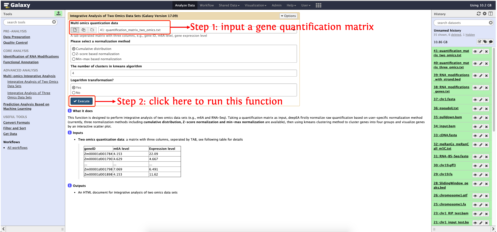

<strong>deepEA User Manual</strong>

(version 1.0)

- deepEA is a convenient, freely available, web-based platform that is capable to support deep analysis of epitranscriptome sequencing data with several general and specific functionalities. deepEA consists of six modules: **Data Preparation, Quality Control, Identification of RNA Modifications, Functional Annotation, Multi-omics Integrative Analysis and Prediction Analysis Based on Machine Learning**. 
- deepEA project is hosted on https://cma2015.github.io/deepEA. 
- The deepEA demo server can be accessed via http://deepea.omicstudio.cloud.
- The following part shows installation of deepEA docker image and detailed documentation for each function in deepEA.

## Multi-omics Integrative Analysis

This module consists of two functions: **Integrative Analysis of Two Omics Data Sets** and **Integrative Analysis of Three Omics Data Sets**.

| **Functions**                                     | **Description**                                              | **Input**                                                    | **Output**                                                   | Time  (test data) | **Reference**    |
| ------------------------------------------------- | ------------------------------------------------------------ | ------------------------------------------------------------ | ------------------------------------------------------------ | ----------------- | ---------------- |
| **Integrative Analysis of Two Omics Data Sets**   | Visualize genes' abundance in two omics data sets via a scatter plot and perform kmeans cluster based on genes' abundace in each omics data. | A quantification matrix of RNA modifications-related genes on two omics data sets | An interactively HTML document recoding the scatter plot and kmeans cluster results | ~5s               | In-house scripts |
| **Integrative Analysis of Three Omics Data Sets** | Group genes into seven categories based on their abundance in each omics data sets and visualize each gene's abundance via a ternary plot | A quantification matrix of RNA modifications-related genes on three omics data sets | An interactively HTML document recoding the ternary plot, categories details defined by multi-omics data | ～6s              | In-house scripts |

## **Integrative Analysis of Two Omics Data Sets**

This function is designed to perform integrative analysis of two omics data sets (e.g., m6A and RNA-Seq). Taking a quantification matrix as input, deepEA firstly normalize raw quantification based on user-specific normalization method (currently, three normalization methods including **cumulative distribution, Z-score normalization and min-max normalization** are available), then using kmeans clustering method to cluster genes into four groups and visualize genes by an interactive scatter plot.

#### Input

- **Two omics quantication data**: a matrix with three columns, seperated by TAB, see following table for details

  |   **geneID**   | **m6A level** | **Expression level** |
  | :------------: | :----------------------: | :------------------: |
  | Zm00001d001784 |          4.153           |        22.09         |
  | Zm00001d001790 |          4.629           |        4.667         |
  |      ...       |           ...            |         ...          |
  | Zm00001d001798 |          7.069           |        6.491         |
  | Zm00001d001898 |          4.153           |        11.62         |

#### Output

- An HTML document for integrative analysis of two omics data sets

#### How to use this function

- **Step 1**: upload gene quantification matrix in `test_data/Quality_Control/quantification_matrix_two_omics.txt`into history panel, please see <a href="https://deepea.nwafu.edu.cn/static/tutorial/2-Quality%20Control.html" target="_blank">here</a> for details about how to upload local data to deepEA server
- **Step 2**: see the following screenshot to run this function

## Integrative Analysis of Three Omics Data Sets

This function is designed to perform integrative analysis of three omics data sets. According RNA modifications-related genes' relative abundace in three omics data sets, deepEA grouped genes into seven categories. For example, if users would like to integrate m6A with gene expression and translation, the following categories will be illustrated in a ternary plot:
  - **Balanced**
  - **m6A dominant**
  - **m6A suppressed**
  - **Expression dominant**
  - **Expression suppressed**
  - **Translation dominant**
  - **Translation suppressed**

#### Input

- **Multi omics quantication data**: see following table for details

  | **geneID**     | **RNA modification level** | **Expression level** | **Translation level** |
  | :------------: | :------------------------------------: | :-------------------: | :---: |
  | Zm00001d001784 | 4.153                                  | 22.09                 | 35.18 |
  | Zm00001d001790 | 4.629                                  | 4.667                 | 5.406 |
  | ...            | ...                                    | ...                   | ...   |
  | Zm00001d001798 | 7.069                                  | 6.491                 | 7.891 |
  | Zm00001d001898 | 4.153                                  | 11.62                 | 24.42 |

- Duplicated gene pairs (homoeologs): see following table for details:

  |   **Gene 1**   |     Gene 2     |
  | :------------: | :------------: |
  | Zm00001d034918 | Zm00001d012811 |
  | Zm00001d034901 | Zm00001d012816 |
  |      ...       |      ...       |
  | Zm00001d034896 | Zm00001d012817 |
  | Zm00001d034876 | Zm00001d012830 |

### Output

- An HTML document for integrative analysis of three omics data sets

#### How to use this function

- **Step 1**: upload gene quantification matrix in `test_data/Quality_Control/quantification_matrix_three_omics.txt`into history panel, please see <a href="https://deepea.nwafu.edu.cn/static/tutorial/2-Quality%20Control.html" target="_blank">here</a> for details about how to upload local data to deepEA server
- **Step 2**: see the following screenshot to run this function
