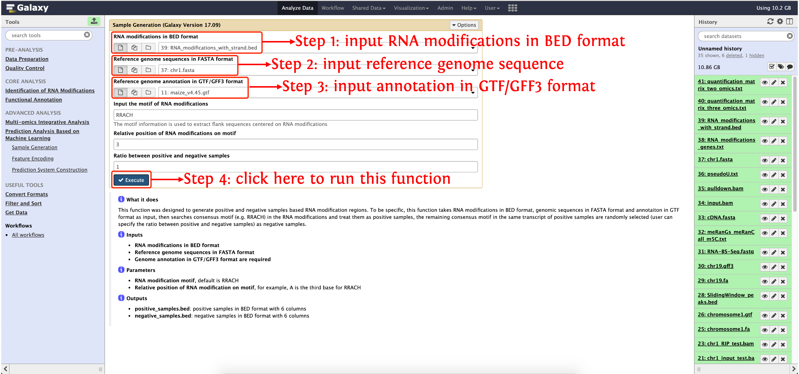
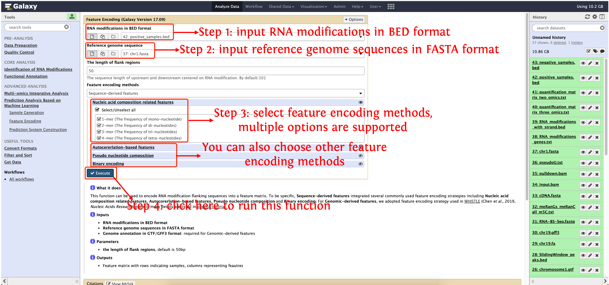
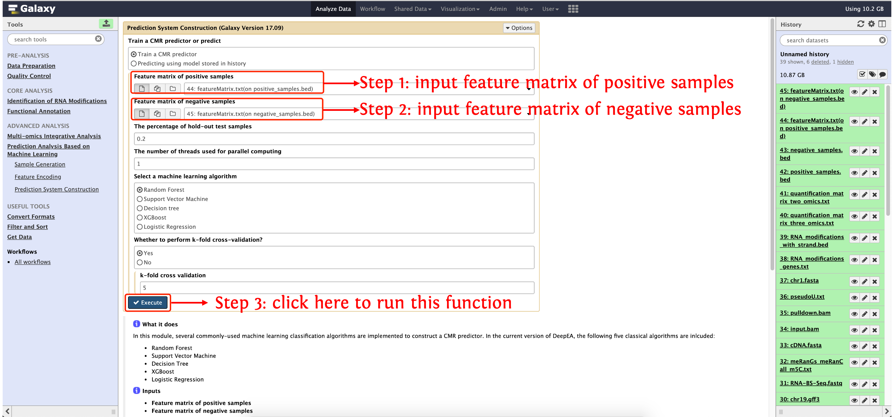

<strong>deepEA User Manual</strong>

(version 1.0)

- deepEA is a convenient, freely available, web-based platform that is capable to support deep analysis of epitranscriptome sequencing data with several general and specific functionalities. deepEA consists of six modules: **Data Preparation, Quality Control, Identification of RNA Modifications, Functional Annotation, Multi-omics Integrative Analysis and Prediction Analysis Based on Machine Learning**. 
- deepEA project is hosted on https://cma2015.github.io/deepEA. 
- The deepEA demo server can be accessed via http://deepea.omicstudio.cloud.
- The following part shows installation of deepEA docker image and detailed documentation for each function in deepEA.

## Prediction Analysis Based on Machine Learning

This module provides a pipeline for transcriptome-wide RNA modification prediction using machine learning technology. This pipeline is consisted of **Sample generation, Feature Encoding and Prediction System Construction**.

| Functions                          |                       **Description**                        |                          **Input**                           |                 **Output**                  | Time (test data) |  **Reference**   |
| ---------------------------------- | :----------------------------------------------------------: | :----------------------------------------------------------: | :-----------------------------------------: | ---------------- | :--------------: |
| **Sample Generation**              | Generate positive and negative samples for machine learning  | RNA modifications in BED format; Reference genome sequences in FAST format; Genome annotation in GTF/GFF3 format | Positive and negative samples in BED format | ~3 mins          | In-house scripts |
| **Feature Encoding**               | Characterize each sample with more than 900 numeric features. | Genome sequences in FASTA format and RNA modifications in BED format |       Feature matrix seperated by TAB       | ~6 mins          | In-house scripts |
| **Prediction System Construction** | Several commonly-used machine learning classification algorithms are provided to construct a predictor to classify RNA modifications from non RNA modifications. |     Positive feature matrix and negative feature matrix      |  A predictor and model evaluation results   | ~15s             | In-house scripts |

## Sample Generation

This function was designed to generate positive and negative samples based RNA modification regions. To be specific, this function takes RNA modification regions in BED format, genomic sequences in FASTA format and annotaiton in GTF format as input, then searches consensus motif (e.g. RRACH) in the RNA modification regions and treat them as positive samples, the remaining consensus motif in the same transcript of positive samples are randomly selected (user can specify the ratio between positive and negative samples) as negative samples.

#### Input

- **RNA modifications in BED format**
- **Reference genome sequences in FASTA format**
- **Genome annotation in GTF/GFF3 format are required**

#### Output

- **positive_samples.bed**: positive samples in BED format with 6 columns
- **negative_samples.bed**: negative samples in BED format with 6 columns

#### How to use this function

- **Step 1**: RNA modifications in BED format can be generated by function **Link RNA Modifications to Genes** in **Functional Annotaion** module.

- **Step 2**: upload reference genome sequences in directory`test_data/Prediction_Analysis_Based_on_Machine_Learning/chr1.fasta` and annotation  in GTF/GFF3 format  in directory `test_data/Quality_Control/maize_v4.45.gtf` to history panel.

- **Step 3**:  see the following screenshot to run this function:

  

## Feature Encoding

This function can be used to encode RNA modifications flanking sequences into a feature matrix. To be specific, **Sequence-derived features** integrated several commonly used feature encoding strategies including **Nucleic acid composition related features**, **Autocorerlation-based features**, **Pseudo nucleotide composition** and **Binary encoding**; For **Genomic-derived features**, we adopted feature encoding strategy used in <a href="https://academic.oup.com/nar/article/47/7/e41/5319125" target="_blank">WHISTLE</a> (Chen *et al*., 2019, *Nucleic Acids Research*) project.

#### Input

- **RNA modification in BED format**: which can be generated by function **Sample Generation**
- **Reference genome sequences in FASTA format**
- **Genome annotation in GTF/GFF3 format**: required for Genomic-derived features

#### Output

- Feature matrix with rows indicating samples, columns representing feautres 

#### How to use this function

- RNA modifications in BED format: the output from last function (**Sample Generation**)

- Reference genome sequences is in `test_data/6-Machine Learning-based Modelling Analysis/chr1.fasta`

- **Note: please run this function two times to generate positive feature matrix and negative feature matrix, respectively**. The following screenshot shows how to use this function to generate positive feature matrix, run this function again but replace the first input with `negative_samples.bed` to generate negative feature matrix.

  

## **Prediction System Construction** 

In this module, several commonly-used machine learning classification algorithms are implemented to construct an RNA modification predictor. In the current version of DeepEA, the following five classical algorithms are inlcuded:

- Random Forest

- Support Vector Machine

- Decision Tree

- XGBoost

- Logistic Regression

#### Input
- **Feature matrix of positive samples**
- **Feature matrix of negative samples**
#### Output

- An RNA modification predictor in binary format
- Cross validation evaluation results in PDF format

#### How to use this function

- Both positive feature matrix and negative feature matrix can be generated by function **Feature Encoding**

- The following screenshot shows how to use this function to train a m6 predictor, and evaluate using 5-fold cross validation

  