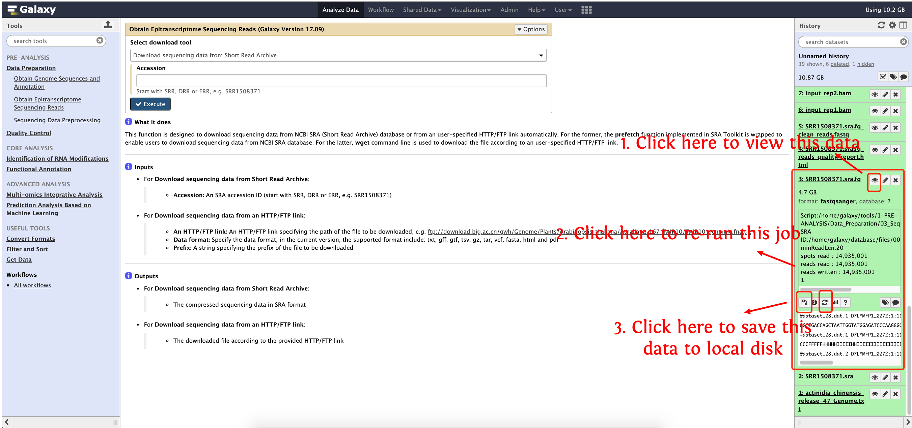
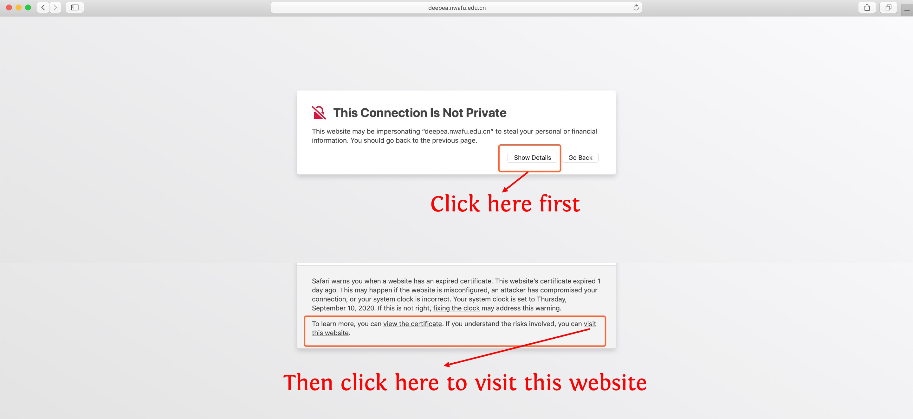
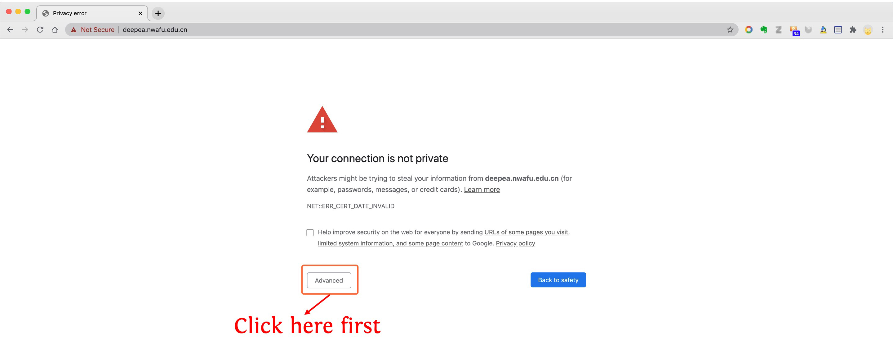
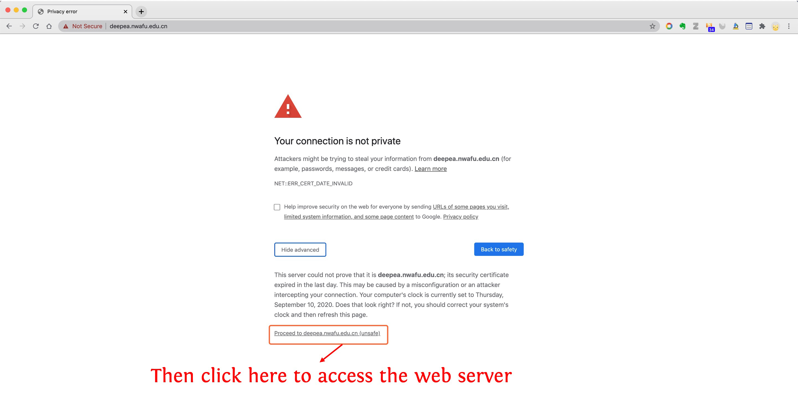
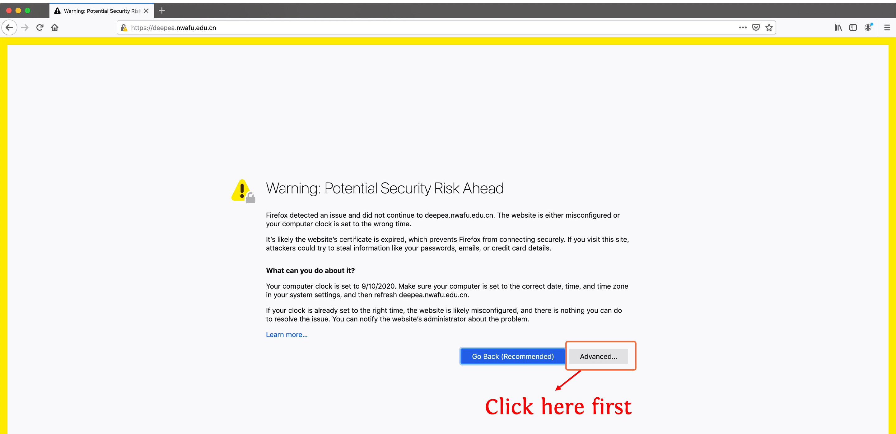
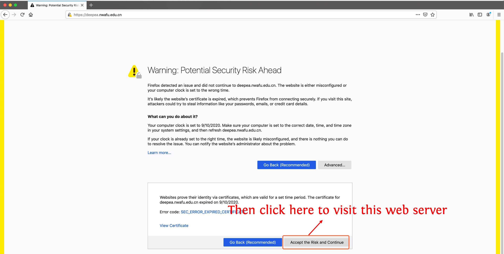

<div align='center' >
<p><font size='70'><strong>deepEA User Manual</strong></font></p>
<font size='100'>(version 1.0)</font>
</div>

- deepEA is a convenient, freely available, web-based platform that is capable to support deep analysis of epitranscriptome sequencing data with several general and specific functionalities. deepEA consists of six modules: **Data Preparation, Quality Control, Identification of RNA Modifications, Functional Annotation, Multi-omics Integrative Analysis and Prediction Analysis Based on Machine Learning**. 
- deepEA project is hosted on https://cma2015.github.io/deepEA. 
- The deepEA demo server can be accessed via http://deepea.omicstudio.cloud.
- The following part shows installation of deepEA docker image and detailed documentation for each function in deepEA.

## Tips and FAQs

The folloing screenshot shows us:

- **How to view the data in deepEA**
- **How to re-run a job**
- **How to save data to your local disk**

	


### I can not access the deepEA server

For the first access of https://deepea.nwafu.edu.cn, the browser may warn that **This Connection Is Not Provate**, see the following pictures to solve the problem:

- For Safari


- For Chrome
  
  

- For Firefox
  
  
  

### How to upload in-house data into deepEA local server

<a href="https://youtu.be/vDd9yQHiYYQ" target="_blank">
    
</a>

### How to become an admin user

- First, register with email `admin@example.org`, set the password arbitrary.

- Then, login with `admin@example.org`


### How to stop deepEA local server
- Press `Ctrl + C` (for windows and unix users) or `Cmd + C` (for Mac OS users)

### How to re-launch deepEA local server when I exited the docker container
- First, using the following command to check the container ID
  ```bash
  docker ps -a
  ```
- Then run the following command
  ```bash
  docker container start  container ID
  docker exec -it container ID bash
  bash /home/galaxy/run.sh
  ```
### How to mount local disk into deepEA docker container

```bash
docker run -it -v /your home directory:/home/galaxy/database/files/000 -p 8080:8080 malab/deepea bash
```


