DeepEA: a Galaxy-based framework for Galaxy-based framework for exploration and large-scale analysis of epitranscriptome sequencing data.
=========================================================================================================================================

Breif introduction
^^^^^^^^^^^^^^^^^^^^

**DeepEA** is a Galaxy-based framework for exploration and large-scale analysis of epitranscriptome sequencing data. DeepEA is an upgrated version of PEA, which is a special designed R toolkit for plant epitranscriptome analysis. In the current version of DeepEA, a variety of modules and functions including data preparation, quality control, CMR (chemical modifications of RNA) profiling and analysis, CMR annotation, CMR prediction and related visualization are implemented to enable users perform large-scale, reproducible epitranscriptome analysis. In addition, by taking advantages of multiple instance learning (MIL) algorithms, DeepEA can precisely localize CMRs in peak regions. This can reduce the false positive CMRs generated by MeRIP-Seq/m6A-Seq/m5C-RIP-Seq, as which can localize CMRs to transcript regions of 100-200 nucleotide long but fail to accurately identify CMRs at single-nucleotide solution. The deePEA project is hosted on https://github.com/cma2015/DeepEA. The DeepEA web server can accessed via http://bioinfo.nwafu.edu.cn:4003. To enable uses build a local DeepEA server, we also packaged DeepEA into a Docker image.

.. contents:: How to do...?
    :local:

-----------------------------------

PRE-ANALYSIS
-----------------------

How do I **import the data** provided by the server, and how do I verify that my input/output is correct ?
^^^^^^^^^^^^^^^^^^^^^^^^^^^^^^^^^^^^^^^^^^^^^^^^^^^^^^^^^^^^^^^^^^^^^^^^^^^^^^^^^^^^^^^^^^^^^^^^^^^^^^^^^^^^^^^^^^^^^^^^^^^^^^^^^^^^^^

* Click the **Share Data** → **Data Libraries** in the top bar.

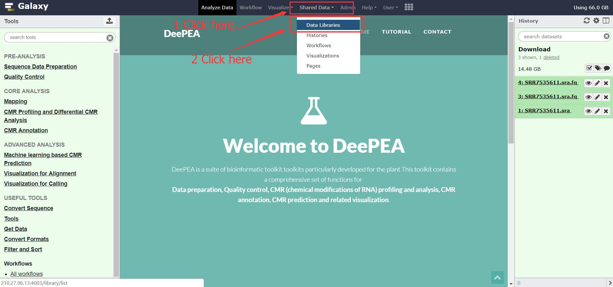

* Find and select the **dataset** you want to use, whatever in 'Genome and annotation data' or 'Step-by-step protocols'.[Please check]

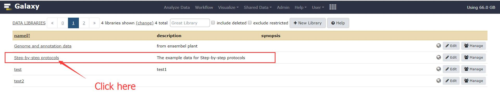

* Click the **To history** → **as Datasets** , then Click **Import** to import data into History bar.

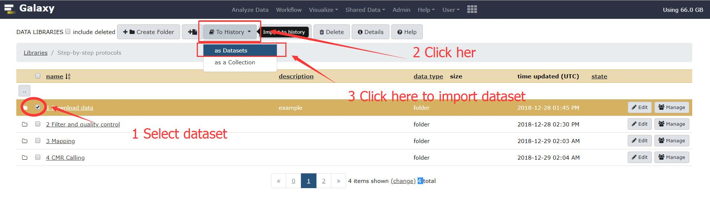

.. tip:: Here we provide a partially downloaded reference genome and annotation file, as well as parts of example output/input file for the functions.

-----------------------------------------

I have downloaded/received a sra/bam/fa/txt... file - How to upload local data ?
^^^^^^^^^^^^^^^^^^^^^^^^^^^^^^^^^^^^^^^^^^^^^^^^^^^^^^^^^^^^^^^^^^^^^^^^^^^^^^^^^^^^^^^^^^^^^^^^^^^^^

- Click **Get Data** in the homepage (see figure below) to upload files.

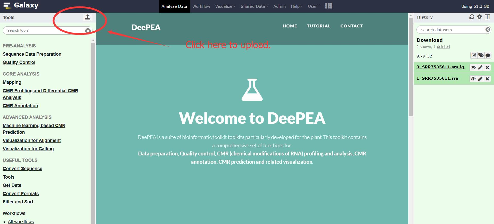

- And then you will see the following interface:

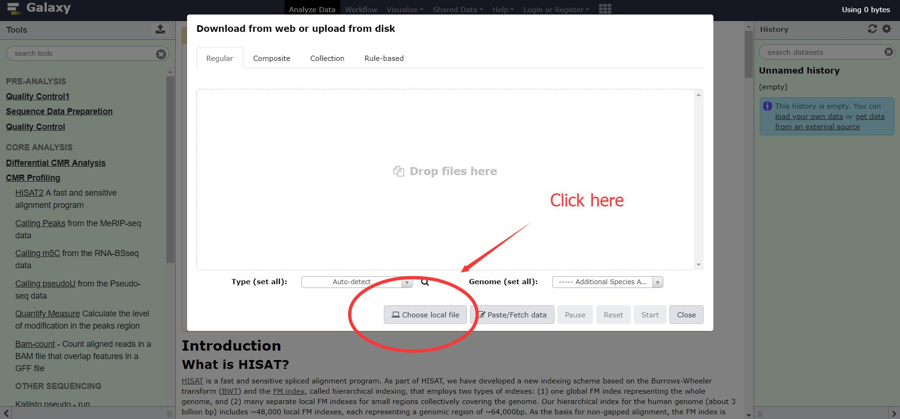

- Next, Click the button **Choose local file** and select a file you would like to upload, you will see the following interface:
  
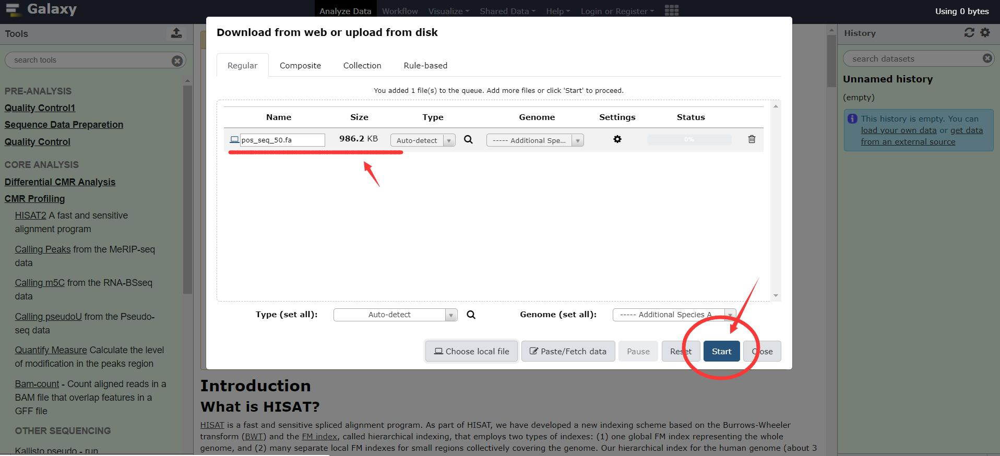

- Then click **Start** to upload file.

-----------------------------------------

How to download and extract data from Short Reads Achive (SRA database)?
^^^^^^^^^^^^^^^^^^^^^^^^^^^^^^^^^^^^^^^^^^^^^^^^^^^^^^^^^^^^^^^^^^^^^^^^^^^^^^^^^^^^^^^^^^^^^^^^^^^^^^^^^^^^^^^^^^^^^^^^^^^^^^^^^^^^^^^^^^^^^^

* Click the **Sequence Data Preparation** and select tool **Download Sequence or Annotation File**.
* Input:
    * Accession: A single SRA accession ID (start with SRR, DRR or ERR).
* Output
    * The compressed sequencing datasets with SRA format.
    
* Submit the task and wait for the task to complete

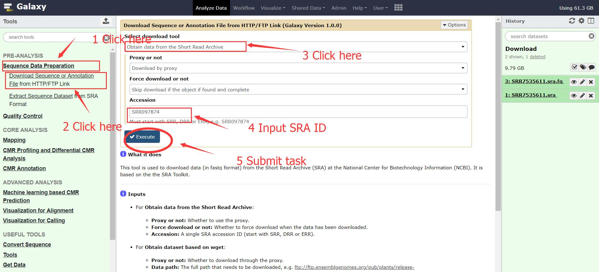

* Click the **Sequence Data Preparation** and select tool **Extract Sequence Dataset**.

* Input:
    * Input sra file: The sequence data (SRA format) (the output from **Download Sequence or Annotation File**).
* Output
    * Fastq format file.

* Submit the task and wait for the task to complete. 

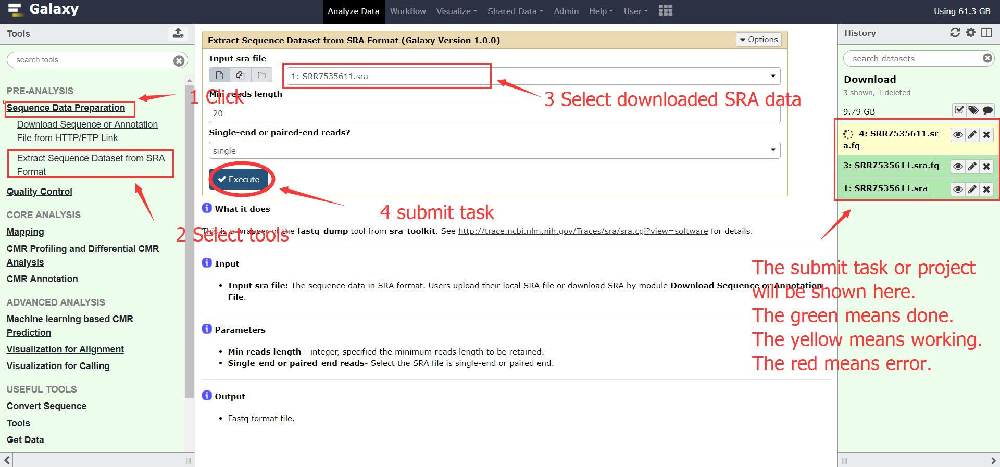

-----------------------------------------

How to perform raw sequence quality control, filtering ?
^^^^^^^^^^^^^^^^^^^^^^^^^^^^^^^^^^^^^^^^^^^^^^^^^^^^^^^^^^^^^^^^^^^^^^^^^^^^^^^^^^^^^^^^^^^^^^^^^^^^^^^^^^^^^^^^^^^^^^^^^^^^^^^^^^^^^^^^^^^^^^

- **Upload** data or add **Filter and quality control** dataset in **Data Libraries** to history
 
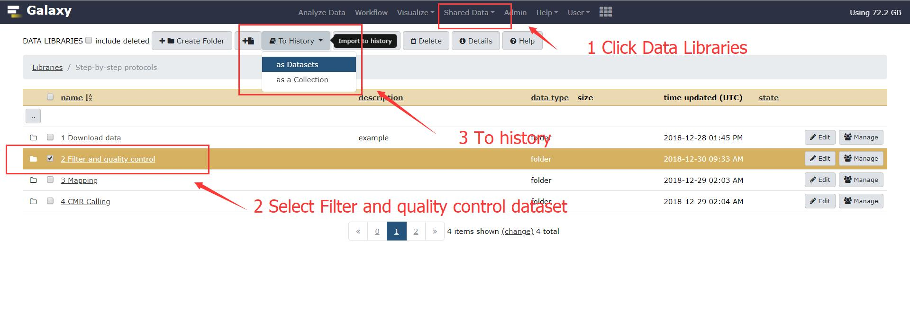
 
 
* Click the **Quality Control** and select tool **Quality and Trimmer of Reads**.
* Input:
    * Input 1: Single-end or Paired-end FASTQ or FASTQ.GZ reads.
* Output
    * Quality and Trimmer of Reads 
    * HTML report
    
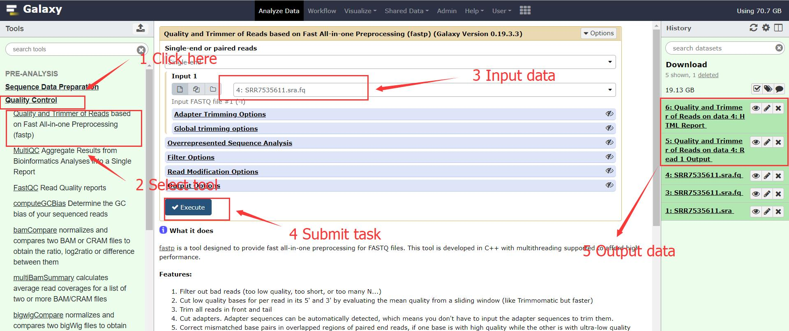

CORE ANALYSIS
-----------------------

How to perform sequence alignment ?
^^^^^^^^^^^^^^^^^^^^^^^^^^^^^^^^^^^^^^^^^^^^^^^^^^^^^^^^^^^^^^^^^^^^^^^^^^^^^^^^^^^^^^^^^^^^^^^^^^^^^^^^^^^^^^^^^^^^^^^^^^^^^^^^^^^^^^^^^^^^^^

- **Upload** data or add **Maping** dataset in **Data Libraries** to history

* Click the **Mapping** and select tool **HISAT2**.
* Input:
    * Reference genome.: Select a reference genome.
    * FASTA/Q file: Single-end or Paired-end FASTQ or FASTQ.GZ reads.

* Output
    * Aligned read (BAM format)
    
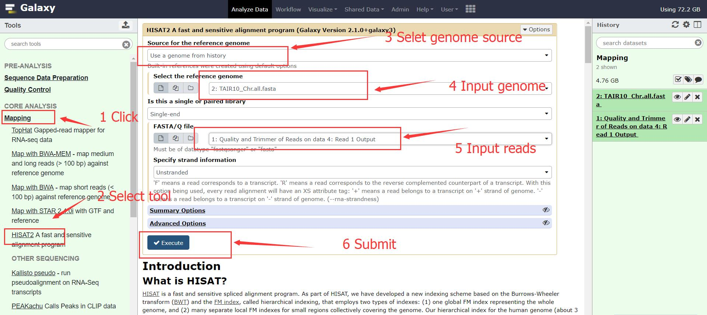

* Waiting for a moment. (About ten minutes)

How to perform CMR Calling?
^^^^^^^^^^^^^^^^^^^^^^^^^^^^^^^^^^^^^^^^^^^^^^^^^^^^^^^^^^^^^^^^^^^^^^^^^^^^^^^^^^^^^^^^^^^^^^^^^^^^^^^^^^^^^^^^^^^^^^^^^^^^^^^^^^^^^^^^^^^^^^

The MeRIP-seq data
~~~~~~~~~~~~~~~~~~~~~~~~~~~~~~~~~~~~~~~~~~~~~~~~~~~~~~~~~~~~~~~~~~~

- **Upload** data or add **CMR Calling from the MeRIP-seq data** in **Data Libraries** to history

* Click the **CMR Profiling and Differential CMR Analysis** and select tool **Peak calling**.

* Input:
    * Input sample: The input control experiment in BAM format.
    * RIP sample: The RIP experiment in BAM format.
    * Reference genome: The Reference genome sequences with FASTA format.
    * Reference annotation file: The Reference genome annotation file with GTF/GFF3 format.

* Output
    * The enriched peak region matrix in BED format.

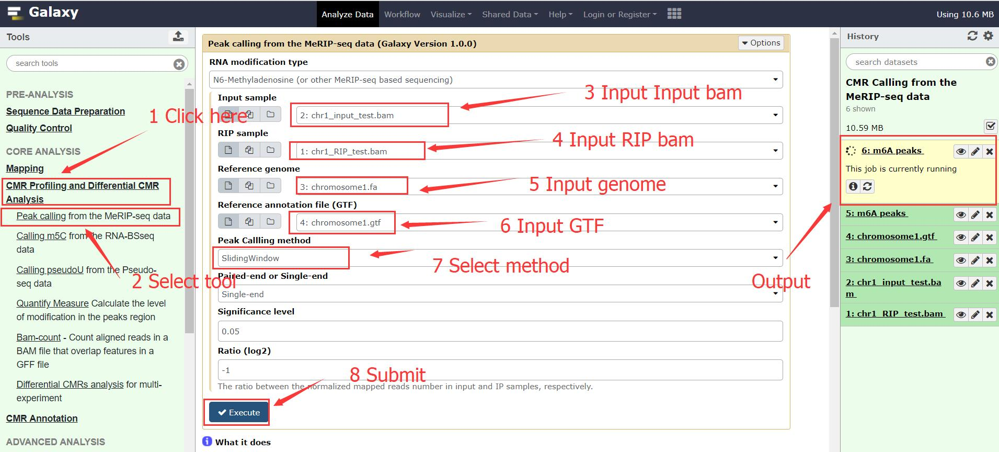

The RNA-BSseq data
~~~~~~~~~~~~~~~~~~~~~~~~~~~~~~~~~~~~~~~~~~~~~~~~~~~~~~~~~~~~~~~~~~~

- **Upload** data or add **CMR Calling from the RNA-BSseq data** in **Data Libraries** to history

* Click the **CMR Profiling and Differential CMR Analysis** and select tool **Calling m5C**.

* Input:
    * FASTQ file: The FASTQ format sequencing file.
    * Reference genome: The reference genome sequences in FASTA format.
    * Reference annotation file (GTF): The reference annotation file in GTF format.

* Output
    * The m5C sites in BED format.

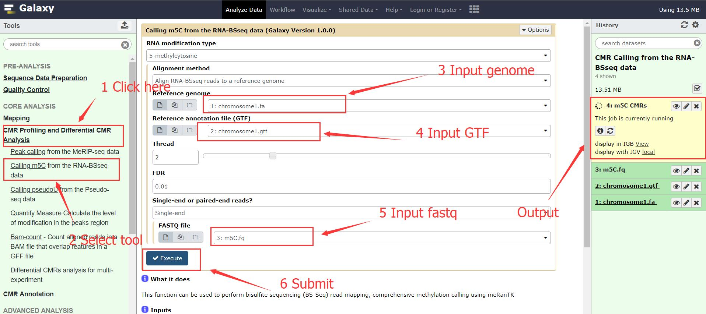

The Pseudo-seq data
~~~~~~~~~~~~~~~~~~~~~~~~~~~~~~~~~~~~~~~~~~~~~~~~~~~~~~~~~~~~~~~~~~~

- **Upload** data or add **CMR Calling from the Pseudo-seq data** in **Data Libraries** to history

.. tip:: This section would cost **several hours**. In order to enable users to quickly understand the output，we uploaded the output in the **Shared Data** (named as **5 CMR Calling from the pseudo-seq data**), see section 1 to see how to import the outputs into History.

* Click the **CMR Profiling and Differential CMR Analysis** and select tool **Calling pseudoU**.

* Input:
    * Read BAM files: The input control experiment in BAM format.
    * Reference genome: The Reference genome sequences with FASTA format.

* Output
    * A list containing the position and ratio for each pseudouridine.

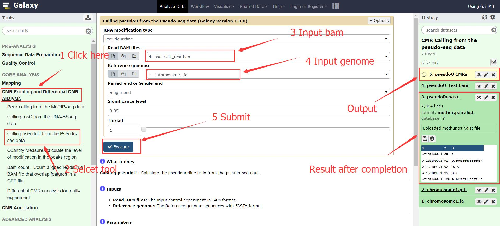

How to visualize CMRs distributions?
^^^^^^^^^^^^^^^^^^^^^^^^^^^^^^^^^^^^^^^^^^^^^^^^^^^^^^^^^^^^^^^^^^^^^^^^^^^^^^^^^^^^^^^^^^^^^^^^^^^^^^^^^^^^^^^^^^^^^^^^^^^^^^^^^^^^^^^^^^^^^^

- **Upload** data or add **CMRs visualization** in **Data Libraries** to history

.. tip:: This section would cost **tens of minutes**. In order to enable users to quickly understand the output，we uploaded the output in the **Shared Data** (named as **7 CMRs visualization**), see section 1 to see how to import the outputs into History.

* Click the **Visualization for Calling** and select tool **CMRs Distribution**.

* Input:
    * CMR region : A tab seperated matrix in BED format.
    * Reference GFF : The annotion file requires the standard gff/gff3 format, recommended download from ensemble plant database.

* Output
    * CMRs distributions at different levels including chromosome, gene, RNA feature and transcript level.(PDF format)

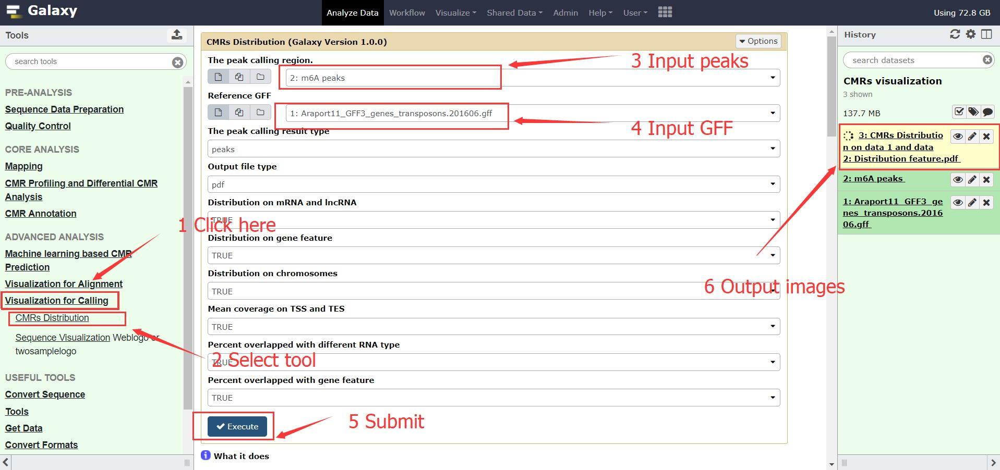

The distributions plot should look like this:

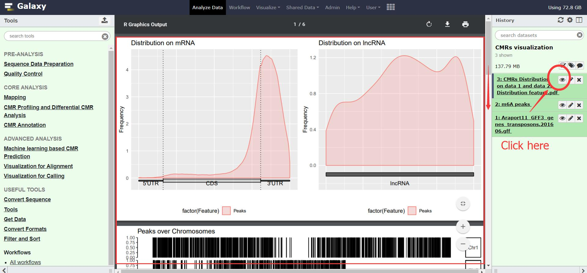

I have a known motif, how to check the distribution of this motif in peaks?
^^^^^^^^^^^^^^^^^^^^^^^^^^^^^^^^^^^^^^^^^^^^^^^^^^^^^^^^^^^^^^^^^^^^^^^^^^^^^^^^^^^^^^^^^^^^^^^^^^^^^^^^^^^^^^^^^^^^^^^^^^^^^^^^^^^^^^^^^^^^^^

- **Upload** data or add **Known motif** in **Data Libraries** to history

* Click the **Convert Sequence** and select tool **Extract Sequence**.

* Input:
    * CMR region : A tab seperated matrix in BED format.
    * Reference genome: Reference genome used in alignment.

* Output
    * Sequence: Generated motif sequence.

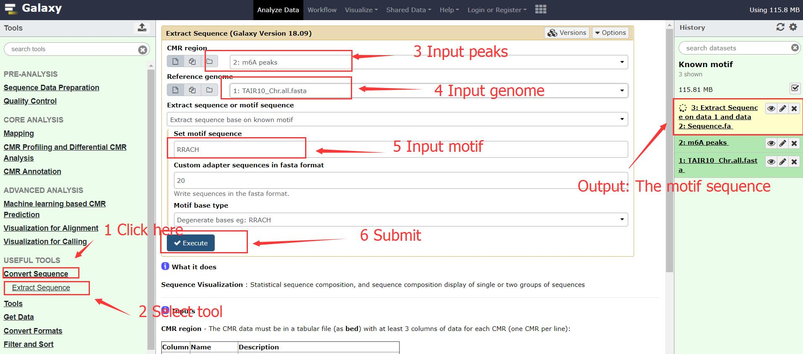

* Click the **Visualization for Calling** and select tool **Sequence Visualization**.

* Input:
    * The plot sequence: The FASTA formatted sequence to be analyzed.
    * The background sequence: Input sequence when performing two sets of sequence difference composition analysis.(Fill in the same sequence without reference in this example)

* Output
    * Known motif logo.(PDF format)

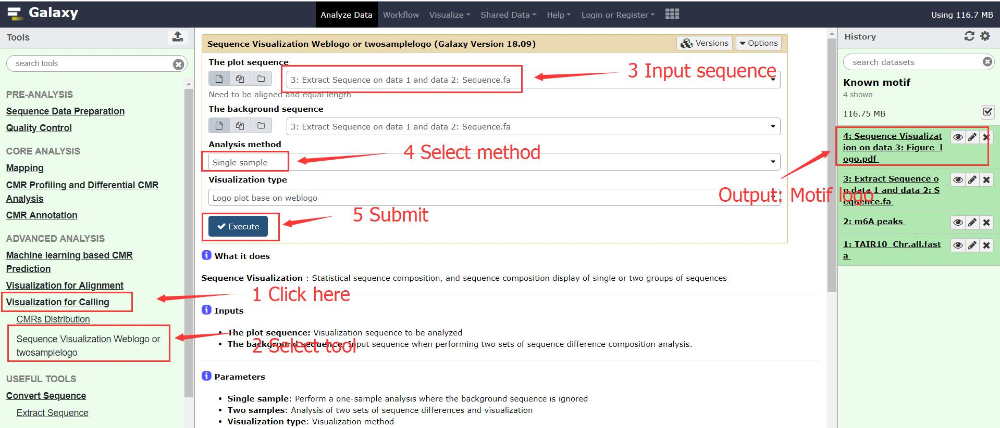

The Known motif logo plot should look like this:

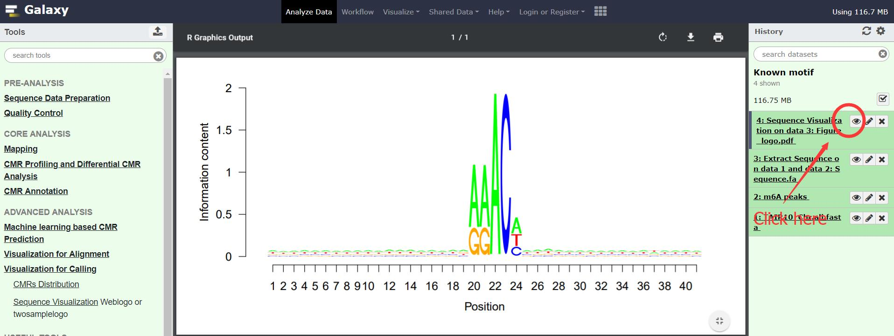

How to perform de-novo motifs discovery?
^^^^^^^^^^^^^^^^^^^^^^^^^^^^^^^^^^^^^^^^^^^^^^^^^^^^^^^^^^^^^^^^^^^^^^^^^^^^^^^^^^^^^^^^^^^^^^^^^^^^^^^^^^^^^^^^^^^^^^^^^^^^^^^^^^^^^^^^^^^^^^

- **Upload** data or add **De-novo motifs discovery** in **Data Libraries** to history

* Click the **CMR Annotation** and select tool **De-novo Motifs Discovery**.

* Input:
    * CMR region : A tab seperated matrix in BED format.
    * Reference GFF : The reference annotation file in GTF format.

* Output
    * Motif annotaion files and discovered motif weblogo images.

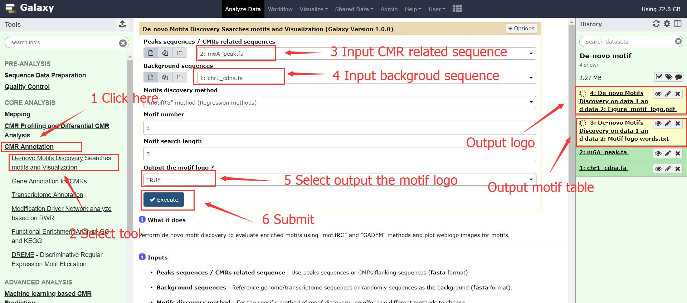

The distributions plot should look like this:

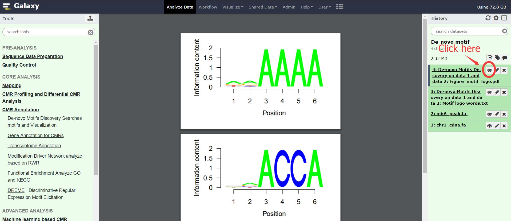

How to obtain the CMR modification level?
^^^^^^^^^^^^^^^^^^^^^^^^^^^^^^^^^^^^^^^^^^^^^^^^^^^^^^^^^^^^^^^^^^^^^^^^^^^^^^^^^^^^^^^^^^^^^^^^^^^^^^^^^^^^^^^^^^^^^^^^^^^^^^^^^^^^^^^^^^^^^^

- **Upload** data or add **Quantification** in **Data Libraries** to history

* Click the **CMR Profiling and Differential CMR Analysis** and select tool **Quantify Measure**.

* Input:
    * Input sample: The input control experiment in BAM format.
    * RIP sample: The RIP experiment in BAM format.
    * Peaks: The peak regions in BED format.
    

* Output
    * A tab seperated matrix containing eight columns ( "MFPKM_FC" "MFPKM_ip" "Reads_ip" "MFPKM_input" "Reads_input "Reads_FC" "log10.p" "log10.fdr")

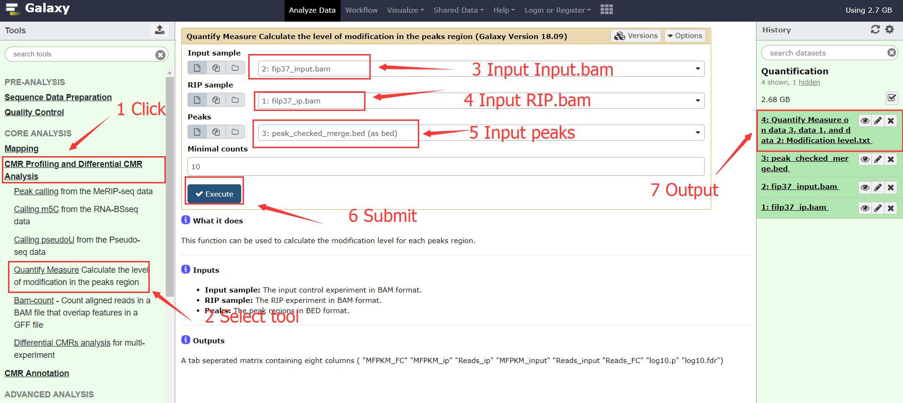

I have multiple replicates and stress experiments, how to perform differential modification analysis?
^^^^^^^^^^^^^^^^^^^^^^^^^^^^^^^^^^^^^^^^^^^^^^^^^^^^^^^^^^^^^^^^^^^^^^^^^^^^^^^^^^^^^^^^^^^^^^^^^^^^^^^^^^^^^^^^^^^^^^^^^^^^^^^^^^^^^^^^^^^^^^

- **Upload** data or add **Multi-experiment** in **Data Libraries** to history

.. tip:: This section would cost **tens of minutes**. In order to enable users to quickly understand the output，we uploaded the output in the **Shared Data** (named as **17 The differential CMR modification**), see section 1 to see how to import the outputs into History.

* Click the **CMR Profiling and Differential CMR Analysis** and select tool **Differential CMRs analysis**.

* Input (Four group):
    * Name: The experiment name.
    * Replicate: The replicate name.
    * Peak files: The peak regions in BED format.
    * RIP BAM files: The RIP experiment in BAM format.
    * Input BAM files: The input control experiment in BAM format.

* Output
    * a table of differentially CMRs in BED format
    * a PDF of plots (Heatmap, PCA plot, Boxplot)
    * an R object with RData format
    * a TAB seperated text file with three columns (number of Intervals, FriP scores, method used)

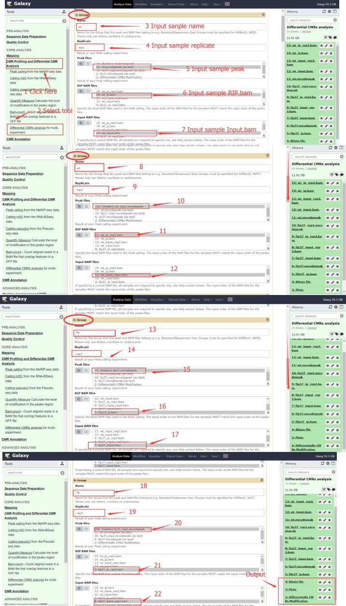

The plot should look like this:

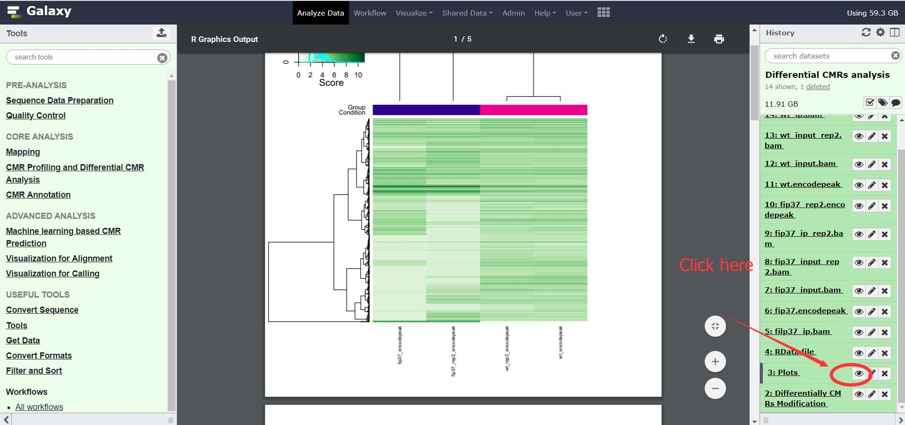

The differentially CMRs table should look like this:

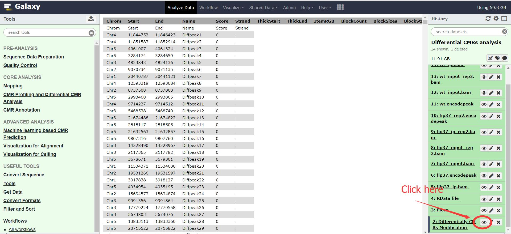

How to perform CMRs annotation?
^^^^^^^^^^^^^^^^^^^^^^^^^^^^^^^^^^^^^^^^^^^^^^^^^^^^^^^^^^^^^^^^^^^^^^^^^^^^^^^^^^^^^^^^^^^^^^^^^^^^^^^^^^^^^^^^^^^^^^^^^^^^^^^^^^^^^^^^^^^^^^

- **Upload** data or add **Annotation** in **Data Libraries** to history

* Click the **CMR Annotation** and select tool **Gene Annotation for CMRs**.

* Input:
    * CMR region :  A TAB seperated matrix in BED format.
    * Reference GFF :  The reference genome annotation file in GTF format.

* Output
    * Gene annotation table	

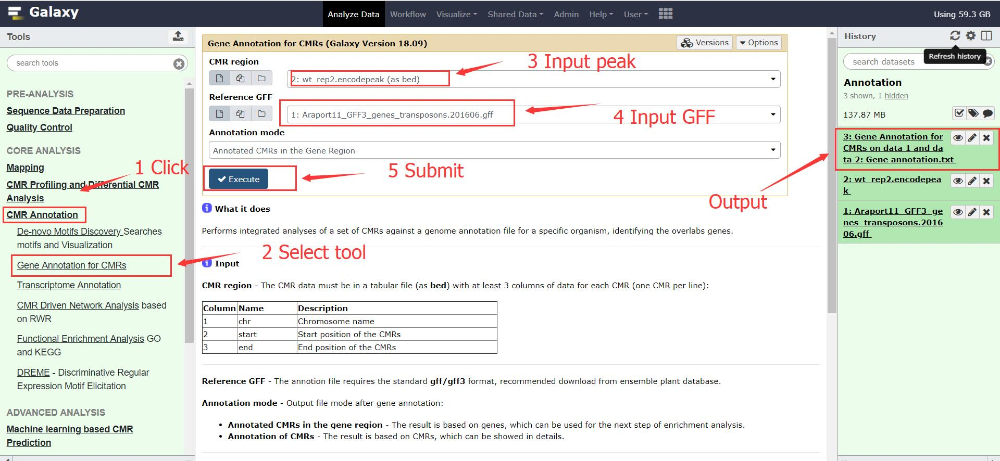

* Click the **CMR Annotation** and select tool **Transcriptome Annotation**.

* Input:
    * CMR region :  A TAB seperated matrix in BED format.
    * Reference GFF :  The reference genome annotaion file in GTF format.

* Output
    * Transcriptome annotation table	

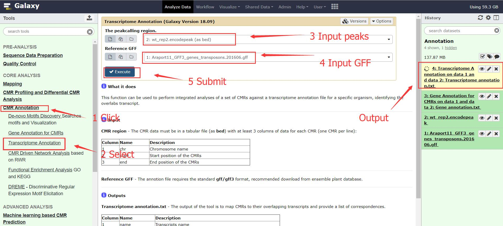

How to predict CMR-driven genes interaction networks ?
^^^^^^^^^^^^^^^^^^^^^^^^^^^^^^^^^^^^^^^^^^^^^^^^^^^^^^^^^^^^^^^^^^^^^^^^^^^^^^^^^^^^^^^^^^^^^^^^^^^^^^^^^^^^^^^^^^^^^^^^^^^^^^^^^^^^^^^^^^^^^^

- **Upload** data or add **Annotation** in **Data Libraries** to history

* Click the **CMR Annotation** and select tool **CMR-Drivern Network analysis**.

* Input:
    * Gene-Gene/Protein-Protein interaction network : A TAB seperated matrix of two columns, each column represent a node in the network. Each line indicates a link.
    * Gene list : List of genes to be analyzed, only the first column will be analyzed.

* Output
    * CMR-driven gene list 
    * CMR-driven Network (PDF format)

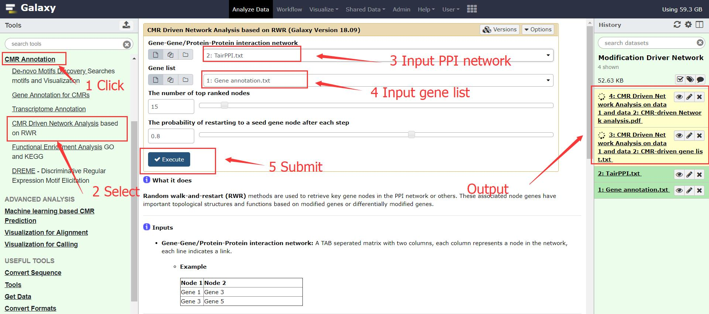

The CMR-driven Network should look like this:

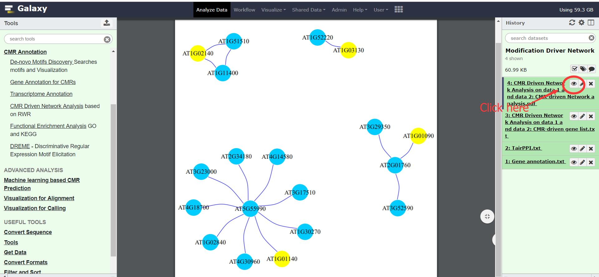

How to perform functional enrichment analysis for CMR related gene?
^^^^^^^^^^^^^^^^^^^^^^^^^^^^^^^^^^^^^^^^^^^^^^^^^^^^^^^^^^^^^^^^^^^^^^^^^^^^^^^^^^^^^^^^^^^^^^^^^^^^^^^^^^^^^^^^^^^^^^^^^^^^^^^^^^^^^^^^^^^^^^

- **Upload** data or add **Functional Enrichment Analyze** in **Data Libraries** to history

* Click the **CMR Annotation** and select tool **CMR-Driven Network analysis**.

* Input:
    * The species name: Input the species name.
    * The modification gene list: List of genes to be analyzed, only the first column will be analyzed.
    * The type of gene names coding (Orgdb support): Select the gene name coding method.

* Output
    * Table_GO - Q-value ascending GO terms.
    * Table_Kegg - Q-value ascending GO terms.
    * Figure_GO - Bar plot and Dot plot and Enrichment Map
    * Figure_GO_level - Equal level of GO enrichment 

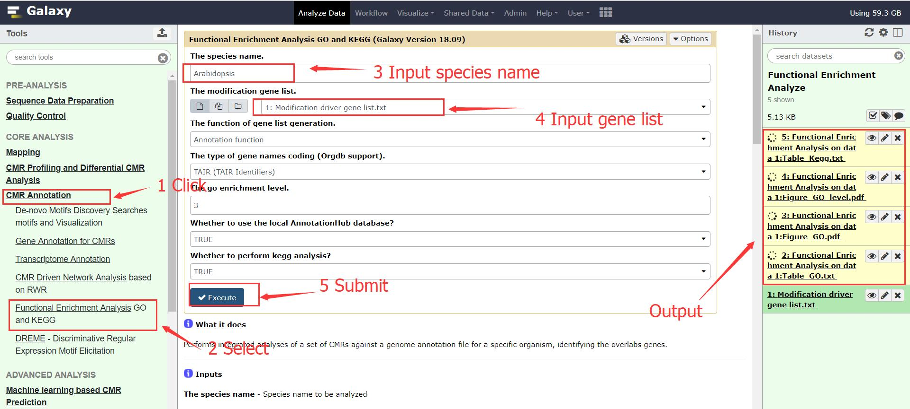

The Figure_GO should look like this:

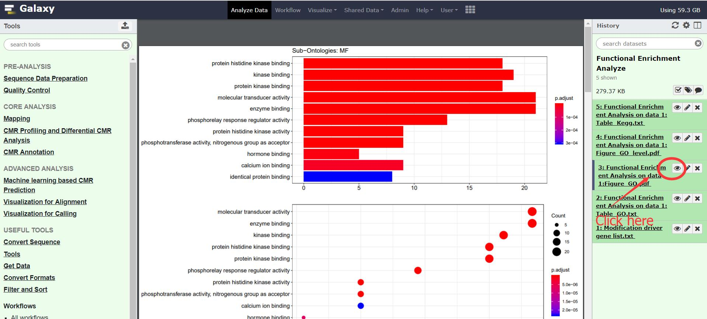

Advanced ANALYSIS
-----------------------

I have peak regions of CMRs, how to obtain its precise position?
^^^^^^^^^^^^^^^^^^^^^^^^^^^^^^^^^^^^^^^^^^^^^^^^^^^^^^^^^^^^^^^^^^^^^^^^^^^^^^^^^^^^^^^^^^^^^^^^^^^^^^^^^^^^^^^^^^^^^^^^^^^^^^^^^^^^^^^^^^^^^^
- **Upload** data or add **Precisely localize CMRs** in **Data Libraries** to history

.. tip:: This section would cost **several hours**. In order to enable users to quickly understand the output，we uploaded the output in the **Shared Data** (named as **15 Precisely localize CMRs**), see section 1 to see how to import the outputs into History.

* Click the **Machine learning based CMR Prediction** and select tool **Precisely localize CMRs from peaks**.

* Input:
    * Peak region: The positive bags in BED format generated by peak calling.
    * Reference genome: The reference genome sequence in FASTA format.
    * Reference annotation file (GTF): The reference annotation file in GTF format.
    * Motif: A string specified the motif.

* Output
    * Model.data: The trained MIL-based model.
    * Normalized_parameter.data: The normalized parameters used in model training.
    * Prediction_score.txt: The predictive probabilistic score for each instance in bags.
    * Reserved_samples.txt: CMRs in single nucleotide resolution.

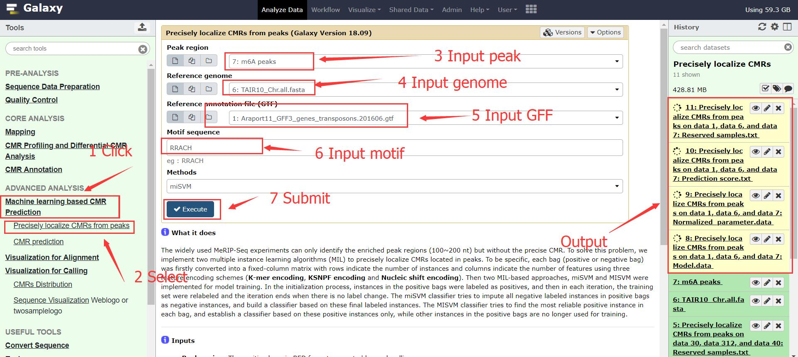

How to predict potential CMRs in the whole transcribed region ?
^^^^^^^^^^^^^^^^^^^^^^^^^^^^^^^^^^^^^^^^^^^^^^^^^^^^^^^^^^^^^^^^^^^^^^^^^^^^^^^^^^^^^^^^^^^^^^^^^^^^^^^^^^^^^^^^^^^^^^^^^^^^^^^^^^^^^^^^^^^^^^
- **Upload** data or add **CMRs prediction** in **Data Libraries** to history

.. tip:: This section would cost **several hours**. In order to enable users to quickly understand the output，we uploaded the output in the **Shared Data** (named as **16 CMRs prediction**), see section 1 to see how to import the outputs into History.

* Click the **Machine learning based CMR Prediction** and select tool **CMR prediction**.

* Input:
    * Reference genome: The reference genome sequence in FASTA format.
    * Reference annotation file (GTF): The reference annotation file in GTF format.
    * Model: The MIL-based model generated by module Machine learning based CMR Prediction.
    * The normalized parameter file: The normalized parameters generated by module Machine learning based CMR Prediction.
    * Motif: A string specified the motif.

* Output
    * Predicted CMR.txt: The predicted CMRs.

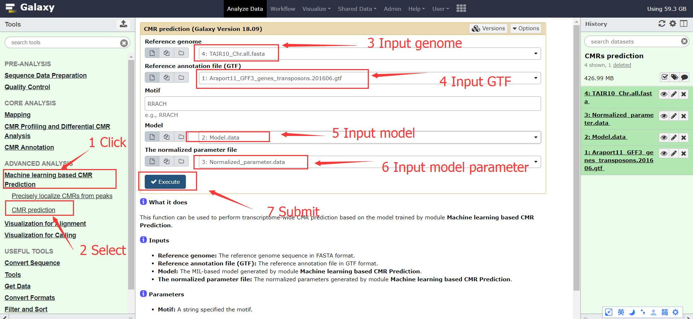

